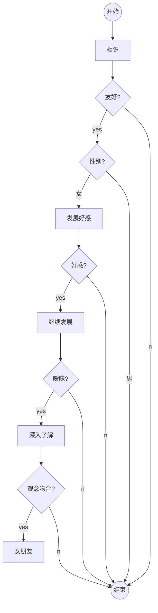

```mermaid
graph TD
start((开始)) --> A[相识]
A --> B{友好?}
B --yes--> C{性别?}
B --no--> 结束((结束))
C --女--> D[发展好感]
C --男--> 结束
D --> F{好感?}
F --yes--> FF[继续发展]
FF --> G{暧昧?}
F --no--> 结束
G --yes--> H[深入了解]
G --no--> 结束
H --> I{观念吻合?}
I --yes--> J[女朋友]
I --no--> 结束
```

