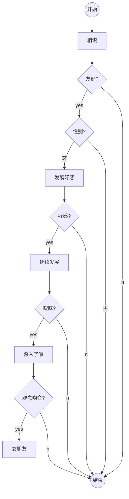

### 个人资料
- 身高：180cm，无虚报。
- 体重：73kg，20230127。
- 地址。山东
- 生日。按农历
- 信仰。表现为无神论的不可知论者。
- 不烟。严格不抽烟。
- 不酒。除非低度甜酒。
### 意向
- 将来发展地区。江浙。所有赏工作的地方。
- 人生规划。赚够钱就退休。
### 社交媒体平台相关
- 微信。常在
- QQ。常在。
- 知乎。2017年开始不再刷知乎，只用作搜索引擎。
- 短视频平台。不看。
- 微博。不看。
### 游戏
- 不玩
- 少玩
- 喜欢玩
### 反感
- 卑微。不尊重自己的人不配得到尊重。
- 张扬。挫锐解纷，和光同尘。
- 丧气。人纵是踩着草鞋，也应仰望星空。

### 加密部分
- 需联系本人
- 

### 一般流程

mammm
